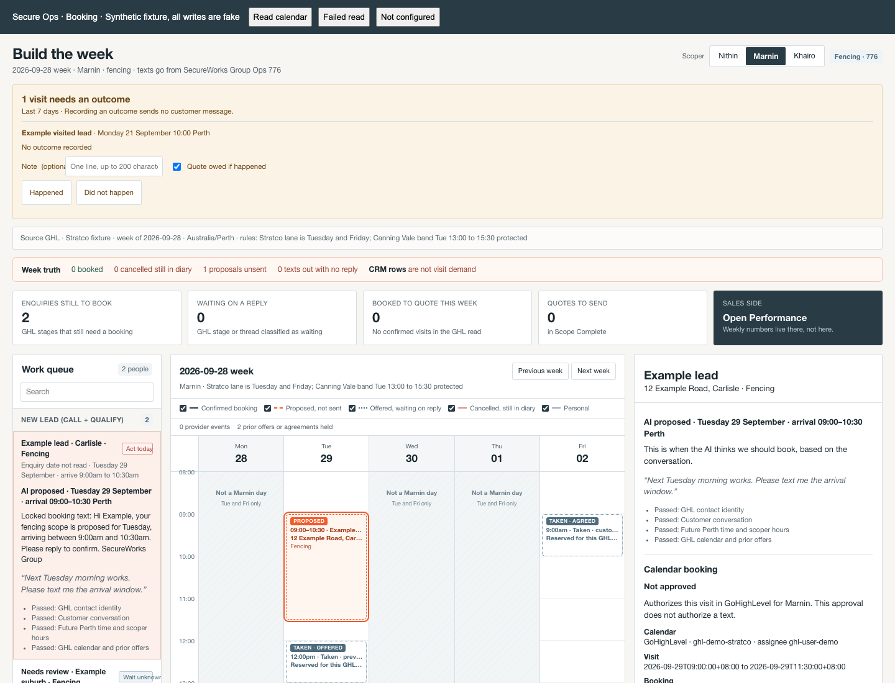
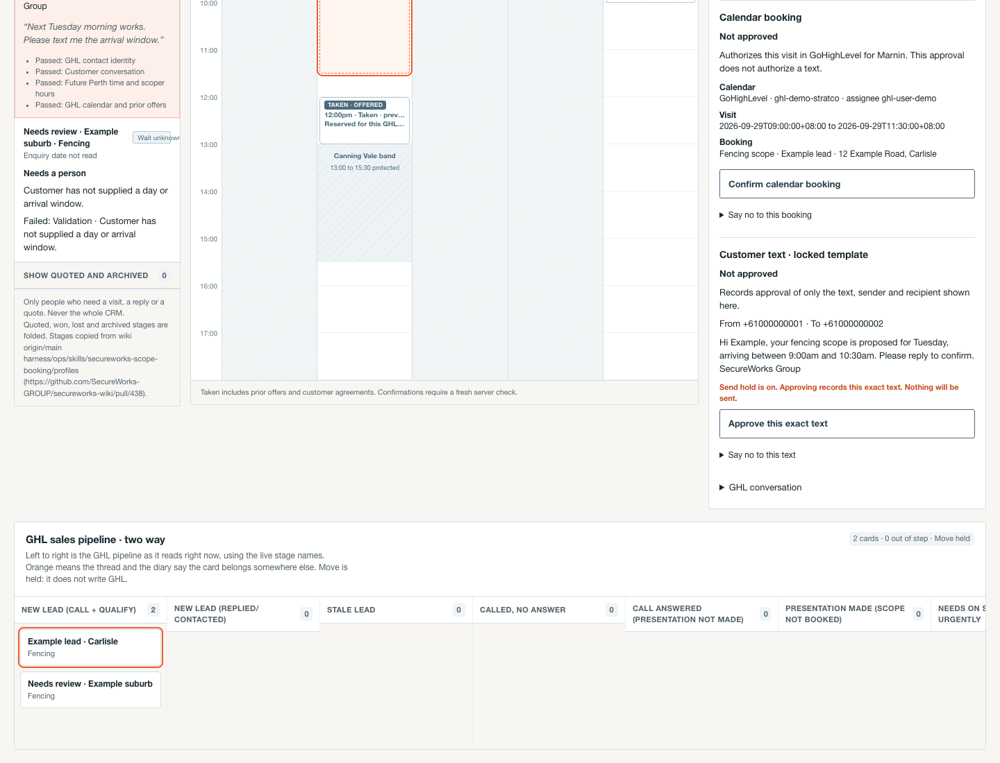
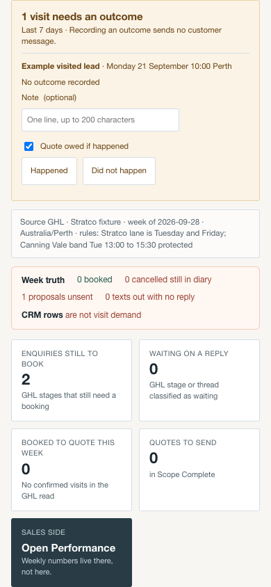
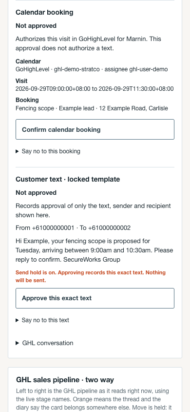
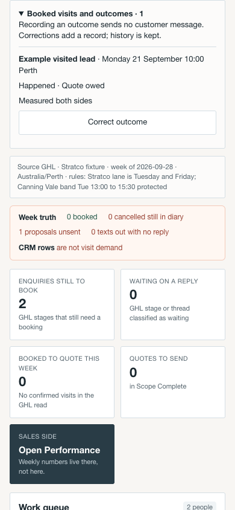
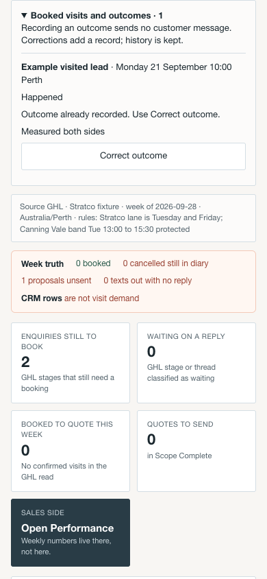

# Booking screen contract fix: offline evidence

Verified 2026-09-22 using `chrome-devtools-axi` and the synthetic fixture at
`tests/fixtures/booking-confirm/index.html`, served on localhost. CSP denies
all network connections. No sign-in, provider call, live outcome append,
calendar booking, customer message or deployment occurred. Approval buttons
were inspected, not pressed in the browser; their separate fake writes are
covered by the executable fixture tests.

- Desktop: 1440 × 1100. Phone: emulated 390 × 844. Both measured zero document
  horizontal overflow. Screenshots were visually inspected.
- Phone interaction: typed a note and pressed Happened. The fake backend
  returned its own UUID/provenance with a UTC-normalized visit time and no
  `ok` field. The screen displayed Happened / Quote owed.
- Pressed Correct outcome, reopened the existing collapsed history fold,
  unticked Quote owed, and pressed Happened again. A second flat request used
  the first returned UUID as `supersedes`; the first row remained unchanged.
- Reloaded through `sales_booking_read`, composed with the fake
  `list_visit_outcomes` (`since`, `until`, `include_history:true`). Both records
  survived. A programmatic duplicate-root attempt returned “Outcome already
  recorded. Use Correct outcome.” with no third request.
- Browser receipts contain exactly two fake `record_visit_outcome` requests.
  No calendar or message approvals were recorded by the browser.
- `npm run test:sales-booking`: 142 passed. Includes independent calendar/text
  approvals, returned server identity, normalized timestamps/notes, bad receipt
  rejection, pending-control disabling, no duplicate insert across reload and
  append-only correction history. `npm run test:ops-asset-cache-bust`: passed.
  `git diff --check`: passed.

The fixture models the workspace producer's outcome-list join. This patch does
not add a second browser list call or prove the live backend's complete booked
visit census. The backend must supply that census and complete correction
chains before advertising `visit_outcomes_read:"complete"`.

## Screenshots for the PR

